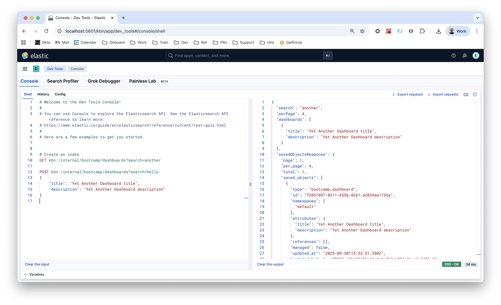

# Bootcamp Plugin

### `kibana.dev.yml`

The following settings can be defined in the `kibana.dev.yml`

```
xpack.bootcamp.dashboards.enabled: true
xpack.bootcamp.dashboards.maxSearchResults: 5
```

### API calls

```
# Search for a dashboard
GET kbn:/internal/bootcamp/dashboards?search=wonderful

# Create a dashboard
POST kbn:/internal/bootcamp/dashboards?search=hello
{
    "title": "Wonderful Dashboard title",
    "description": "Wonderful Dashboard description"
}

```



### UI Settings

Defined in `/common/ui_settings.ts`. These can be found (and modified) under `Stack Management` > `Advanced Settings` > Search for `bootcamp`.


### Permissions

The permission model is defined in the [`features.ts`](features.ts) file.

```ts
features.registerKibanaFeature({
  id: 'bootcamp1',
  name: 'Bootcamp',
  description: 'Bootcamp feature description',
  category: DEFAULT_APP_CATEGORIES.management,
  app: ['bootcamp1'],
  privileges: {
    all: {
      app: ['bootcamp1'],
      api: ['create_dashboards',
  ....
```

Once defined properly these can be modified via Kibana UI under `Stack Management` > `Roles` > `Create Role` > `Kibana` > `Assign to Space` > `Select spaces` > `* All Spaces` > `Management` > `Bootcamp`.

As follows:


### PR checks and testing

There are some scripts you can run before merging a PR and to test your changes.


```sh
$ yarn quick-checks

# To fill data
$ node scripts/synthtrace.js --help

# To fill with apache logs
$ node scripts/synthtrace.js apache_logs

$ node scripts/i18n_check --fix

$ node scripts/type_check

$ node scripts/type_check [path-to-location]
```

#### FTR Tests (functional tests)

Functional test runner tests. Executed with **Selenium WebDriver** tests.

Need both a client and server running side by side. Used for server side integration checks. Runs an instance of elasticsearch in the background.

Terminal 1

```
$ yarn test:ftr:server --config ./x-pack/..../oblt.streams.serverless.config.ts
```

Terminal 2

```
$ yarn test:ftr:runner --config ./x-pack/..../tests/manual_configuration_without_security.ts
```

(something about GrokDebuggerPage)

#### Scout Tests (also functional tests)

Scout consumes Page object from Playwright.

Examples

```
/x-pack/platform/plugins/shared/streams_app/test/scout/ui/fixtures/page_objects/streams_app.ts

/x-pack/platform/plugins/shared/streams_app/test/scout/ui/tests/data_management/data_processing/create_steps.spec.ts
```

To run the tests

Terminal 1

```
node scripts/scout.js start-server --serverless=oblt
```

Terminal 2

```
npx playwright test --config x-pack/..../streams_app/test/scout/ui/playwright.config.ts
```
See example in the [README.md](https://github.com/elastic/kibana/blob/9650da839fff9fee4b8323baee42fba1239e53f7/x-pack/platform/plugins/shared/streams_app/ui_tests/README.md)

### JSDoc

Please add some JSDoc when adding packages that other people are going to use.

```ts
/**
   * Creates a {@link SavedObjectsClientContract | Saved Objects client} that
   * uses the internal Kibana user for authenticating with Elasticsearch.
   * This client supports extensions (encryption, spaces) but bypasses user-based security.
   *
   * @param options - Options for configuring the internal client.
   *
   * @remarks
   * This is intended for internal operations that need extension support
   * (like encryption) but should not be scoped to a specific user.
   *
   * **Security Note**: The security extension is automatically excluded to prevent
   * user-based filtering. Use this only for operations that should run with
   * system-level privileges.
   *
   * Use this instead of creating fake requests to work around security scoping.
   *
   * @example
   * ```typescript
   * // Basic usage
   * const client = savedObjects.getUnsafeInternalClient();
   *
   * // With hidden types
   * const client = savedObjects.getUnsafeInternalClient({
   *   includedHiddenTypes: ['fleet-agent-policies']
   * });
   * ```
   */
  getUnsafeInternalClient: (
```
