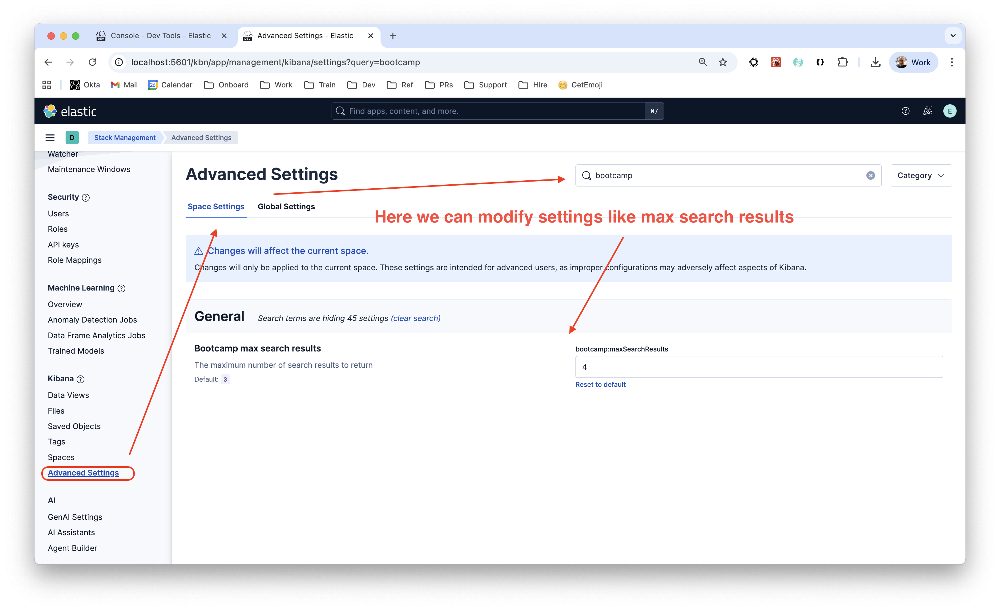
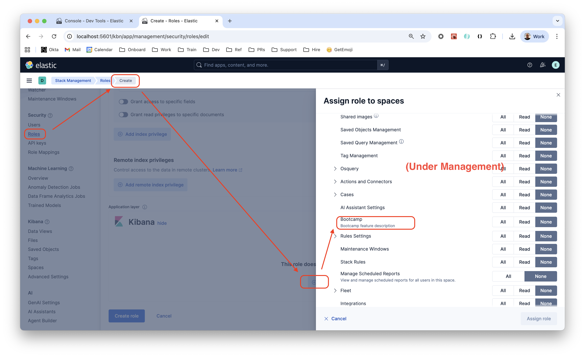

# Bootcamp Plugin

### `kibana.dev.yml`

The following settings can be defined in the `kibana.dev.yml`

```
xpack.bootcamp.dashboards.enabled: true
xpack.bootcamp.dashboards.maxSearchResults: 5
```

### API calls

```
# Search for a dashboard
GET kbn:/internal/bootcamp/dashboards?search=wonderful

# Create a dashboard
POST kbn:/internal/bootcamp/dashboards?search=hello
{
    "title": "Wonderful Dashboard title",
    "description": "Wonderful Dashboard description"
}
```


### UI Settings

These can be found (and modified) under `Stack Management` > `Advanced Settings` > Search for `bootcamp`.



### Permissions

The permission model is defined in the [`features.ts`](features.ts) file.

```ts
features.registerKibanaFeature({
  id: 'bootcamp1',
  name: 'Bootcamp',
  description: 'Bootcamp feature description',
  category: DEFAULT_APP_CATEGORIES.management,
  app: ['bootcamp1'],
  privileges: {
    all: {
      app: ['bootcamp1'],
      api: ['create_dashboards',
  ....
```

Once defined properly these can be modified via Kibana UI under `Stack Management` > `Roles` > `Create Role` > `Kibana` > `Assign to Space` > `Select spaces` > `* All Spaces` > `Management` > `Bootcamp`.

As follows:

